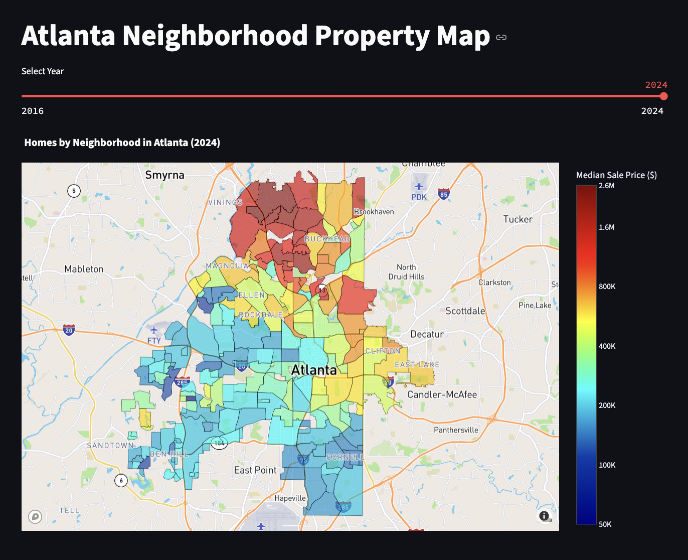
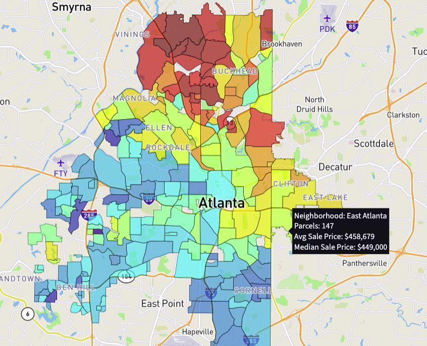

# Atlanta Residential Sales

## Description
Atlanta Neighborhood Annual Mean Sale Prices from 2016-2024 displayed on a map with color indicating price.  Can hover over neighborhood in the map to see the mean and average sale price and number of sales.

[*** Included Data was collected from public sources ***](#source_data)

## Tech basics
This repository can be used to build and run a docker container or run locally.

The code here doesn't connect to any external data sources and is fully self contained.

Developed in python.

### Local test run from terminal:
* Clone or download this repository eg:
`git clone https://github.com/d3crypt1/atlanta.git`
* From the atlanta_sales_app directory:
`streamlit run atlanta_sales_streamlit.py`

### To build/run usin docker-compose
* From terminal in the atlanta_sales_app directory:
`docker-compose up -d --build`

### Screenshot of hover

### Source Data Notes

* The data folder contains a GeoJSON with 244 Atlanta Neighborhoods, it's last edite date is 2022-05-24.
[Official Atlanta Neighborhood Map](https://dpcd-coaplangis.opendata.arcgis.com/datasets/6ccb72814c4e481a8162a55a3e11b2d2_1/about)
* Historic neighborhood boundaries are not used, past sales data uses current neighborhood boudaries.
* The annual sales data is stoed in separate .csv files for each year atlanta_{year}.csv
* The annual sales data was scraped from public sources.
* The sales data is considered to be accurate as multiple sources were used to verify accuracy.
* No GUARANTEE or WARRANTY is given or implied for data accuracy or anything contained in this repository.
